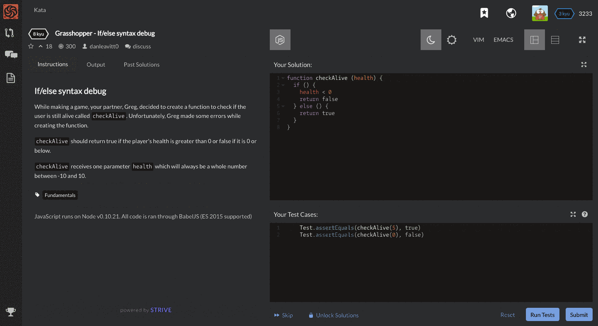

# Codewars

[Codewars](http://codewars.com) is an online platform where users solve real coding challenges. This curriculum utilizes codewars to reinforce concepts when students break out into coding stations.

**Authentication:** [Github](http://github.com)

### Layout

##### Challenge
On the left half of the page there are instructions that describe the challenge the user needs to solve. This is also where feedback from tests is given.

##### Editor
The top right portion of the screen is the code editor. This is where the user writes code to complete the challenge.

##### Test cases
The bottom right area shows the example test cases. These are provided by the author of the exercise and ensure that the users code sufficiently solves the problem.
