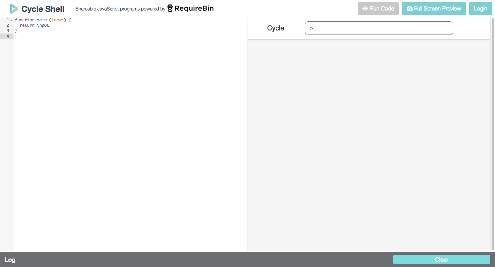
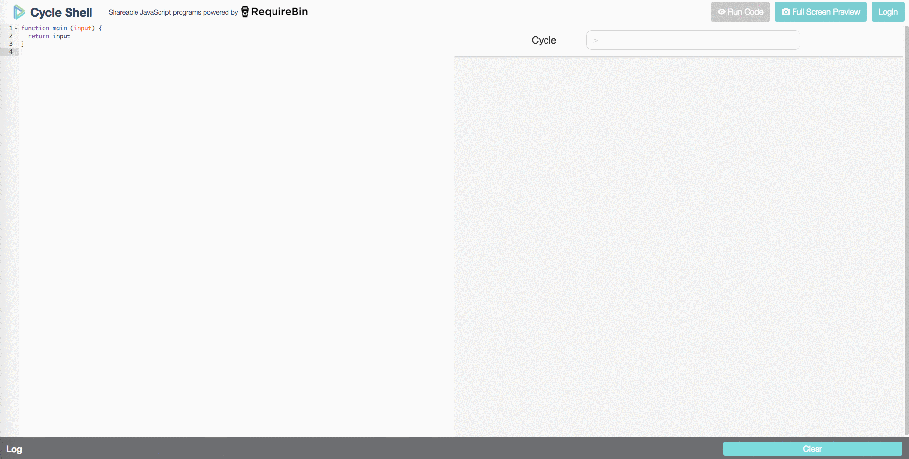
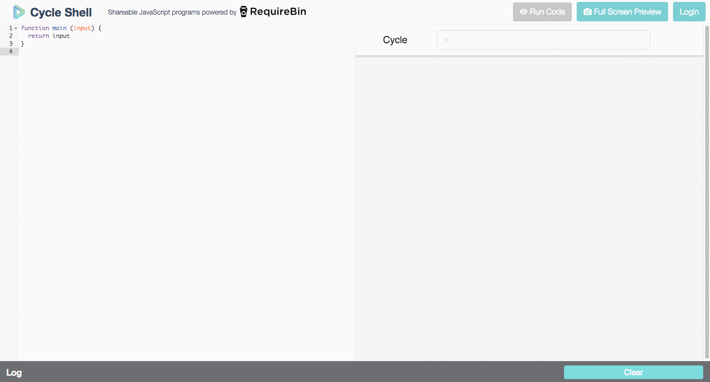

# Cycle shell

Using [cycle shell](http://cycle.sh) students can interact with their computer in a terminal like environment. This allows students to build meaningful web applications with only and introductory knowledge of Javascript.

**Authentication:** [Github](http://github.com)



### Layout

##### Preview
The right side of the screen is an interactive preview of the program you created. You can also use the `Full Screen Preview` button to open a new tab that show only your program (no code editor).

##### Editor
The code editor is located on the left hand side of the website. This is where you create your program.

##### Log
At the bottom of the screen is a log that displays error and console messages. It alerts about a new message by adding a number next to the log indicating the number of unread messages.

### How it works

##### The `main` function
The function `main` is required to make cycle-shell work. The function is called whenever the input box on the right side of the screen submits. The input is parsed (split at every space) and passed to the `main` function as parameters. The return value of the `main` function is outputted as a card element.



Example:

```
input: hello
```
```js
function main (input1) { //input1 = 'hello'
  return input1 // returns 'hello'
}
```

```
input: hello daniel
```
```js
function main (input1, input2) { // input1 = 'hello' input2 = 'daniel'
  return input2 // returns 'daniel'
}
```

##### Running the code
Anytime the code is altered, you must use the `Run Code` button to compile the new program. You can use the standard keyboard shortcut on your operating system to save.

Mac: `cmd + s`

Windows: `ctrl + s`

##### Errors
The code editor features live syntax error checking. Additional errors and console messages are printed in the log at the bottom of the screen.


